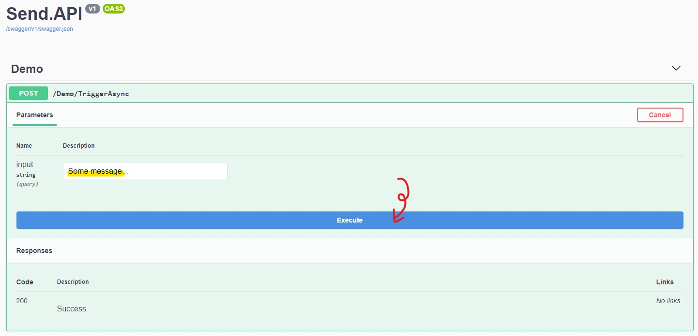
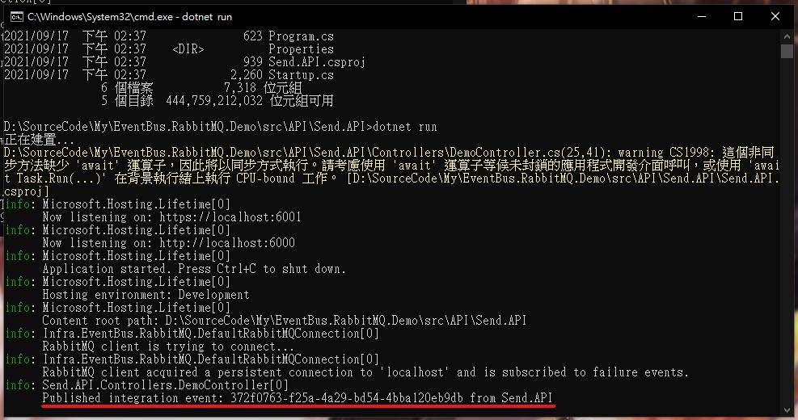
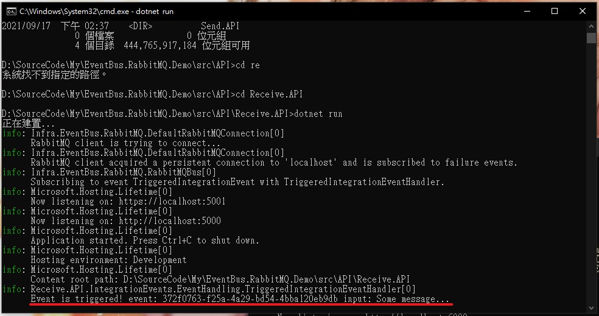

# EventBus.RabbitMQ.Demo

透過 RabbitMQ 簡單示範如何使用 EventBus。  
Easy to demo how to use event bus with RabbitMQ.

## How to test

> 複製這個儲存庫。

1. Clone this repo.

   ```
   git clone https://github.com/cdcd72/EventBus.RabbitMQ.Demo.git
   ```

> 至示範資料夾位置並初始化需要的子模組。

2. Go to demo directory and init needed submodule.

   ```
   cd EventBus.RabbitMQ.Demo
   git submodule init
   git submodule update
   ```

> 將 RabbitMQ 容器跑起來。

3. Run rabbitmq container.

   ```
   docker run -it --rm --name rabbitmq -p 5672:5672 -p 15672:15672 rabbitmq:3.9-management
   ```

> 打開兩個終端器。

4. Open two terminals.

   > 將接收 API 跑起來（主要示範**如何訂閱事件**，但它本身也能發送事件）：

   Run the receive api（Focus on subscribe event, but it can publish event）:

   ```
   cd Receive.API
   dotnet run
   ```

   > 將發送 API 跑起來（主要示範**如何發送事件**，但它本身也能訂閱事件）：

   Run the send api（Focus on publish event, but it can subscribe event）:

   ```
   cd Send.API
   dotnet run
   ```

> 至 https://localhost:6001/swagger/index.html 發送你的事件訊息。

5. Go to https://localhost:6001/swagger/index.html publish your event message.
   

> 回去你已經打開的兩個終端器並看結果訊息。

6. Go back to your opened two terminals and see the result message.  
   Send.API
   
   Receive.API
   
